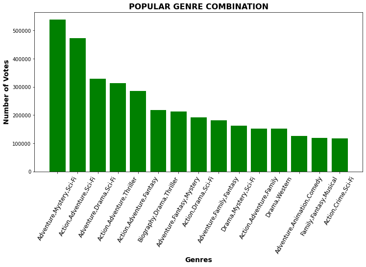
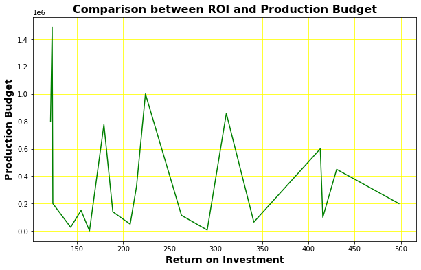
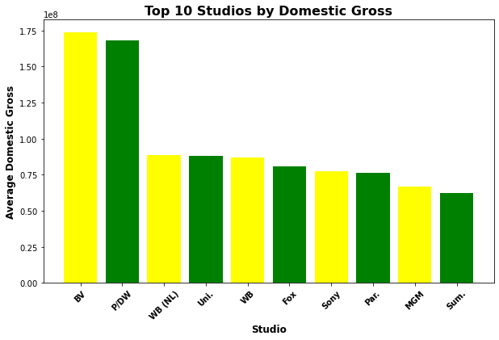

# Microsoft Movie Studio Analysis 
### (Authored by Lynne. K. Mutwiri)

## Overview
I would like to start by thanking you for trusting me with this task and congratulating you for deciding to venture into the lucrative field of original movie creation. Over the years, film content consumption has increased across all age brackets. From the older generation to children, people are spending lots of hours on the screen watching content; documentaries, comedy, drama, sci-fi and much more as I have outlined herein. 
In this project, I will take you through the research I did to come up with an analysis that will guide you in the next phase of your implementation.

## Business Problem
Now that you are fully decided on setting up a movie studio, I have come up with a few factors that will help guide on how to do it. The big question you want answered is what films to produce in order to optimize your returns. Along with answering that question, I have come up with a few more questions and their answers, leading to actionable insights that will help you make fully informed decisions at every point of the implementation.
The following are the questions whose answers I have come up with in this analysis:
* What film genres are doing best at the box office?
* Who are the anticipated competitors in the film industry?
* What is the profitability of movie production(ROI)?
* Which directors have the highest rated movies?

## Data Understanding and Analysis

### Source of Data
I used data from the following files and tables to compute my analysis for this project:
* tmdb.movies.csv
* tn.movie_budgets.csv
* bom.movie_gross.csv
* IM Database

### Data Analysis
Some key aelements I chose to work with are:
* Movie genres, both individual and grouped.
* Studios and domestic gross info. I picked out studios that generated the highest domestic gross income. These are your anticipated competitors, from whom you can pick a thing or two to improve on.
* Using the worldwide gross and production cost info, I computed the return on investment(ROI) vis a vis the cost of production for various movies.

### Data Visualization

### Graph of most popular genres

### Graph of the Return on Investmment

### Graph of the top 10 studios in domestic gross income

## Conclusion
* From the top performing studios, you can benchmark to learn or improve on strategy so as to rise above the competition.
* The most popular genre combination is one that contains both Adventure and Sci-Fi.
* High capital investment does not necessarily mean high returns.
* You could use some of the top rated directors to help in the film creation.
